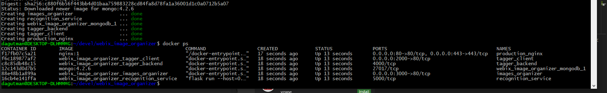

#### Overview

The image organizer app and the tagger application can be run directly from command line, but we also have dockerized versions to simplify deployment.  Docker can be a bit confusing, as you need to expose ports within a container for it to work at all.  Also remember the internal exposed port "within" the container can be mapped to any external port.  

### Building a standalone image organizer app

You need to be in the root directory of the system (i.e. webix_image_organizer) if you cloned the repository. Each directory has its own Dockerbuild file.

The <i>.env</i> file must be created and edited before building the application if the project uses one.

You need to run the command in the directory with the appropriate <i>Dockerfile</i> 

```bash
    docker build -t imgorg .
```

## Running image organizer

```bash
    docker run -p 3000:80 -t imgorg
```

This will run the app imgorg and you can access it on port 3000.  The port on the left (i.e. 3000) is on YOUR machine, the one on the right maps to the port within the docker container.

## Testing in a local environment...

We have set up a docker-compose script that will build tagger, image organizer, faceted search, rcm and an additional container that runs some basic image analysis scripts.  To build the containers, type:

```bash
    docker-compose up -d --build
```

## NOTES

For now you can run Images Organizer and/or Tagger client by following the instruction:
1. go to directory with Dockerfile (project directory for IO and ./tagger directory for Tagger)
2. run "docker build -t <your name> ." command (this will build the image);
3. run "docker run -itd -p <your port>:80 <image name>"

this will run the app on the specified port.

Don't forget to run the taggerAPI separately (build image and run the container from ./tagger/server directory).
it uses 4000 port by default, so to run the container use the following command:

```bash
    docker run -itd -p <your port>:4000 <image name>
```

Added it to "docker" branch
So try to run docker-compose up -d --build now and check /tagger, /io /api, /marker /label /sticker routes

## Stopping all running docker containers
```bash
    docker stop $(docker ps -aq)
```
   
### Remove all containers.
```bash
    docker rm $(docker ps -aq)
```

### Remove all images.

```bash
    docker rmi $(docker images -q)
```

## After running docker build

You should see something like this if you run `docker ps` which indicates the various containers and services are up and running. 


## Accessing services

In this configuration, the image organizer is running on port 3000, faceted  search on port 8000, rcm on port 6000, tagger on port 2000, tagger api on port 4000 and the image recognition service is running on port 5000.
